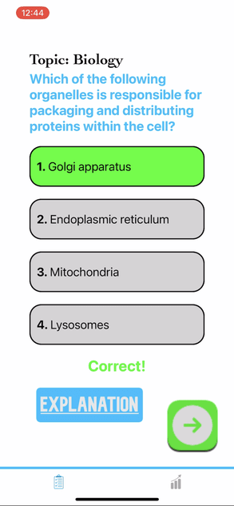

# MCAT_Study_Tool
This mobile app is a dynamic study tool that uses OpenAI integration to prompt users with AI-generated MCAT questions, answer choices, and explanations. The app includes a user statistics page that tracks the accuracy, struggling topics, and more!

